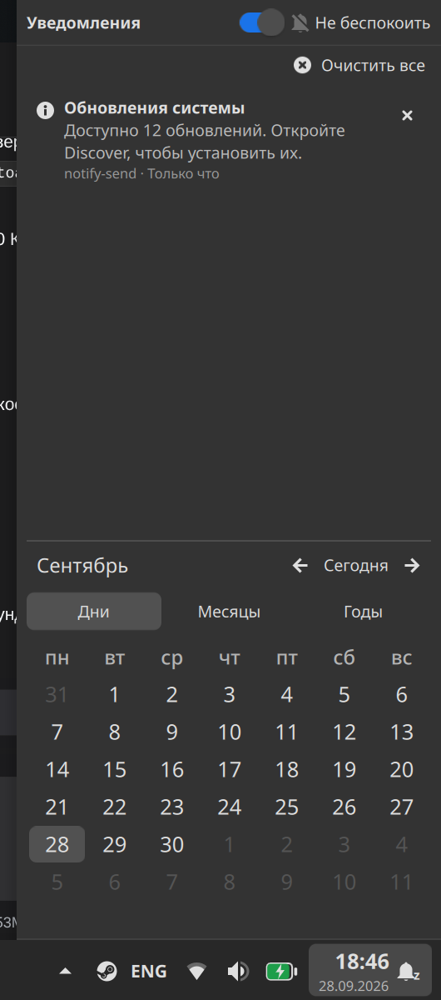
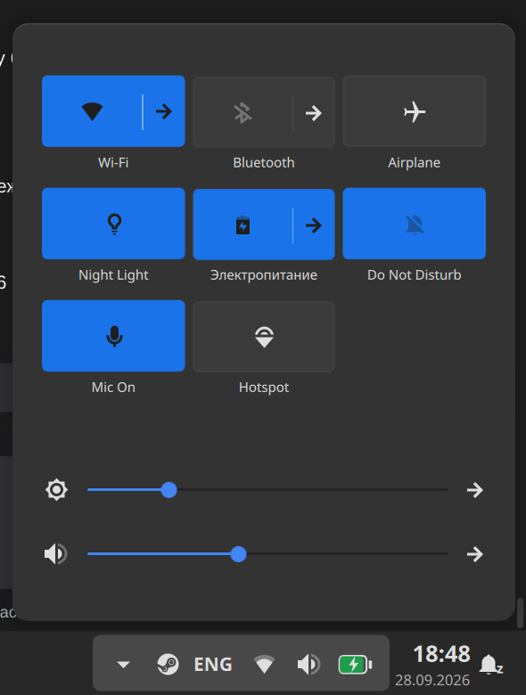
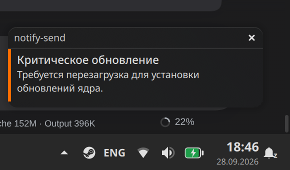

# plasmoids — монорепозиторий плазмоидов Win11 для KDE Plasma 6

Пять апплетов в стиле Windows 11 для панели KDE Plasma 6 (Qt 6 / KF6).
Единый репозиторий нужен, чтобы изменения можно было откатывать через git.
Репозиторий: <https://github.com/mops1k/kde6-win11-plasmoids> (ветка `main`).

## Состав

| Каталог | id апплета | Тип | Что это |
| --- | --- | --- | --- |
| `win11tray/` | `org.mops1k.win11tray` | C++ / CMake | замена системного трея, сводный поповер быстрых настроек |
| `win11tasks/` | `org.mops1k.win11tasks` | C++ / CMake | таскбар icons-only с Win11-тултипами и превью |
| `win11battery/` | `org.mops1k.win11battery` | QML (KPackage) | батарея с процентом внутри, системное меню питания |
| `win11clock/` | `org.mops1k.win11clock` | QML (KPackage) | часы над датой, уведомления, календарь, «Не беспокоить» |
| `win11keyboardlayout/` | `org.mops1k.win11keyboardlayout` | QML (KPackage) | индикатор раскладки (РУС/ENG) с настройками шрифта |

Проектные детали (сборка, зависимости, грабли) — в `AGENTS.md` каждого каталога.

## Предпросмотр

Панель целиком (таскбар, трей, часы, индикатор раскладки, батарея):


Поповер часов — календарь, история уведомлений и переключатель «Не беспокоить»:



Поповер трея — сводные быстрые настройки (сеть, Bluetooth, ночной свет,
электропитание, «Не беспокоить», микрофон, точка доступа, яркость, громкость):



Всплывающее уведомление (toast) от плазмоида часов:



## Установка

```bash
./scripts/install.sh              # интерактивный выбор (whiptail-чекбоксы)
./scripts/install.sh --all        # установить все
./scripts/install.sh --only win11tray,win11clock
./scripts/install.sh --list       # только показать список
```

C++-плазмоиды собираются CMake (`build/`), QML-плазмоиды ставятся
`kpackagetool6`. Установка идёт в `~/.local` без root; `plasmashell`
перезапускается один раз в конце (`--no-restart` отключает).

Замена системных апплетов в панели — отдельными скриптами проекта:
`win11tray/scripts/switch-tray.sh`, `win11tasks/scripts/switch-tasks.sh`,
`win11clock/scripts/switch-clock.sh`, `win11battery/scripts/switch-battery.sh`,
`win11keyboardlayout/scripts/switch-widget.sh`.

Режим «плавающей» панели (в Plasma 6 панель сама открепляется на рабочем
столе, из-за чего поповеры панельных апплетов заезжают на апплет) —
`scripts/panel-floating.sh`:

```bash
./scripts/panel-floating.sh status   # показать режим панелей
./scripts/panel-floating.sh off      # прикрепить к краям экрана
./scripts/panel-floating.sh on       # вернуть авто-открепление
./scripts/panel-floating.sh toggle   # переключить
```

Без `--no-persist` настройка сохраняется в `plasma-org.kde.plasma.desktop-appletsrc`
(`[PlasmaViews][Panel <id>] floating=0/1`) при остановленном `plasmashell`,
с бэкапом конфига.

## Откат

```bash
git log --oneline                 # история изменений
git diff <коммит> -- win11tray    # что изменилось в плазмоиде
git restore --source=<коммит> -- win11tray   # вернуть файлы из коммита
```

Откат установленного плазмоида — `scripts/uninstall-local.sh` в каталоге
проекта (`--restore` возвращает системный апплет в панель).

## Что не в репозитории

`.gitignore` исключает референс-скриншоты Win11 (`Screenshot*.png`),
`build/` и `build-*/`, `dist/` и `*.plasmoid`, а также `.dsh/` — планы и
рабочее состояние сессий DSH.
